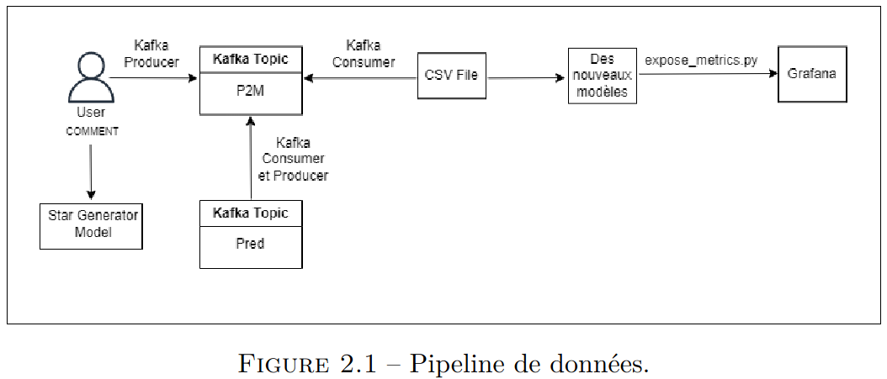

# Real-Time Sentiment Analysis and Star Rating Generator

## Project Description

This project focuses on real-time sentiment analysis of user comments. The solution instantly analyzes opinions expressed in comments and classifies them as positive or negative. 

Additionally, the project addresses the challenge of missing star ratings in comments. A machine learning model is used to automatically generate star ratings from 1 to 5 based on the content of each comment.

## How the Flow Works
The data pipeline operates as follows:

A user submits a comment, which is stored by a `Kafka Producer` in a `Kafka Topic` named "P2M".
Two processes are triggered simultaneously:
- A Kafka Consumer and Producer retrieve the texts from the "P2M" Topic, process them through the `sentiment classification model`, and store the predictions in another Topic called "Pred". 
These predictions are binary (0 for negative, 1 for positive) and are then sent to Grafana via Prometheus for visualization of the desired statistics.

- Another `Kafka Consumer` retrieves the texts from the "P2M" Topic and converts them into a CSV batch for the model's retraining. The performance metrics of the models are sent to Grafana for monitoring.

## Results Obtained

### Sentiment Classification Model: 
The model shows excellent performance with an accuracy and F1-score both exceeding 0.86.

### Star Rating Generator Model: 
The model has an accuracy of 0.36, correctly classifying 36% of the elements. 
However, these results are affected by the poor quality of the data, as the dataset is unbalanced, and extracting 10,000 samples per class was insufficient for proper training.